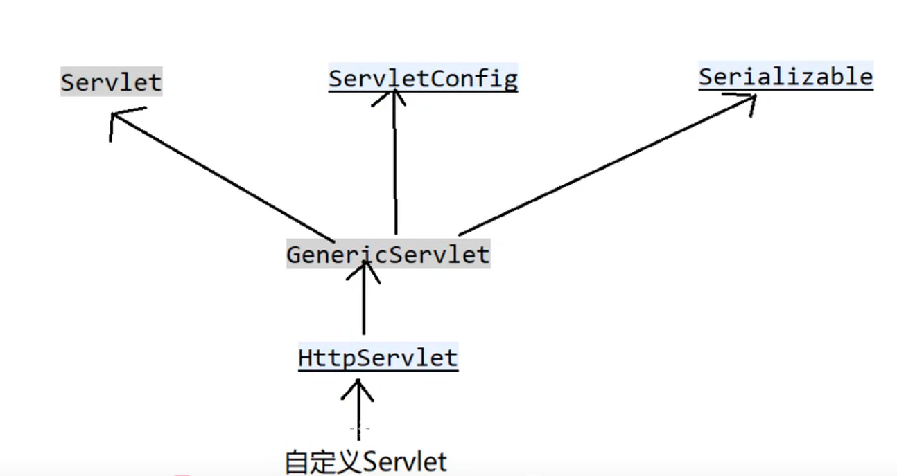

## 对应于HTTP协议的软件包

## 其他软件包

## Servlet继承关系

ServletConfig()接口：
getServletContext(): 获取Servlet上下文对象， application
getInitParameter(String): 在当前Servlet范围内，获取名为name的参数值
 1. ServletContext()的常见方法：
    getRealPath():绝对路径
    getContextPath()
    getAttribute(),setAtttribute()
    getInitParamter(String) 在当前Web容器范围内，获取名为name的参数值