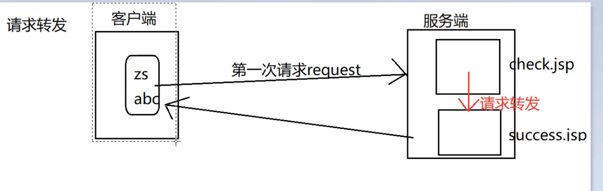

response:

响应对象

addCookie(Cookie cookie):服务端向客户端增加一个Cookie对象
sendRedirect(String location): 页面跳转的一种方式
setContentType():设置服务端响应的编码

## 重定向与请求转发的区别

1. 地址栏是否改变：重定向--变，请求转发--不变
2. 是否在一次请求中有效（是否保留第一次请求时的数据）：重定向--不保留，请求转发--保留
3. 请求的次数：重定向--2，请求转发；1
4. 跳转发生的位置：重定向--客户端二次跳转 ，请求转发--服务端

