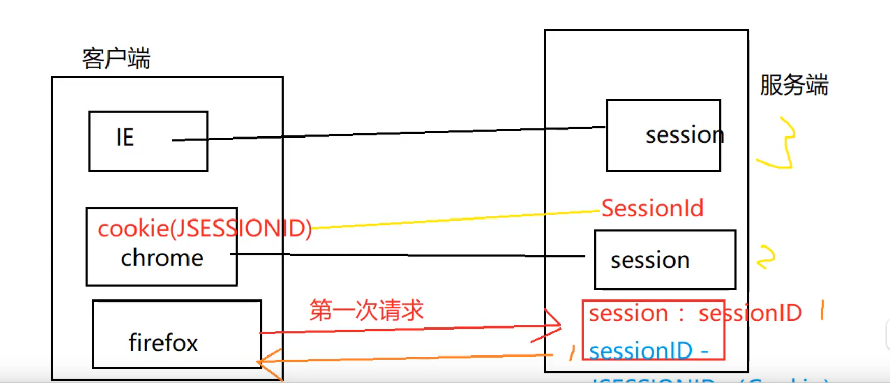

## session:会话  （一次开始到一次结束）

1. 浏览网站：开始-结束
2. 购物：浏览-付款-结束
3. 电子邮件

## session机制

客户端第一次请求服务端时，服务端会产生一个session对象（用于保存客户端信息），
并且每个session都会有一个sessionid(用于区分其他session)，
服务端会产生一个cookie，并且活该cookie的name为JSESSION，value为sessionID
然后，服务端会在响应客户端的同时，将该cookie发送给客户端，至此，客户端就会有一个cookie（JSESSIONID)，
因此，客户端的cookie就可以和服务端的session一一对应（JSESSIONID--sessionID）

客户端第n次请求时，服务端会先用客户端的JSESSIONID去服务端的session中匹配sessionID，如果匹配成功，
说明此用户不是第一次访问，就无需再登录

session：

1. session是存储在服务端的
2. session是在同一个用户请求时共享

## session方法：
getId();//获取sessionID
boolean isNew(); //

## session共享问题