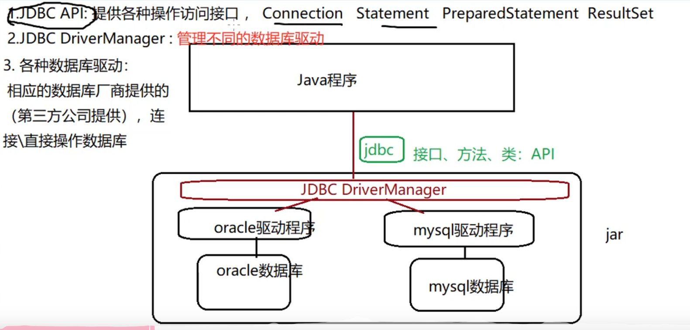
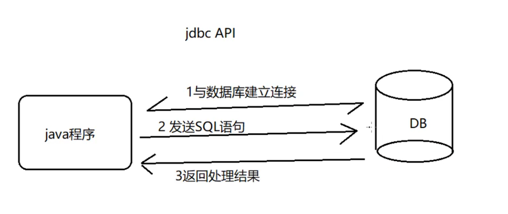

JDBC:Java DataBase Connectivity: 

JDBC API:主要功能

具体通过以下接口或者/类实现：

1. DriverManager:驱动
2. Connection：链接（DriverManager产生）
3. Statement(PreparedStatement)：SQL请求 (通过Connection产生)

4. CallableStatement：调用数据库的存储过程/存储函数(通过Connection产生)

5. Result；结果集（Statement产生）

Connection产生操作数据库对象：
Statement: createStatement()
PreparedStatement: prepareStatement()
CallableStatement: prepareCall()

Statement:
增删改：executeUpdate()
查：executeQuery()

PreparedStatement:(interface)
增删改：executeUpdate()
查：executeQuery()
赋值：setXxx()

ResultSet:
next():boolean,光标下移
getXxx(): arg:字段名，索引

**具体步骤**

a. 导入驱动程序
b. 建立链接
c.发送sql
d. 返回 结果集

