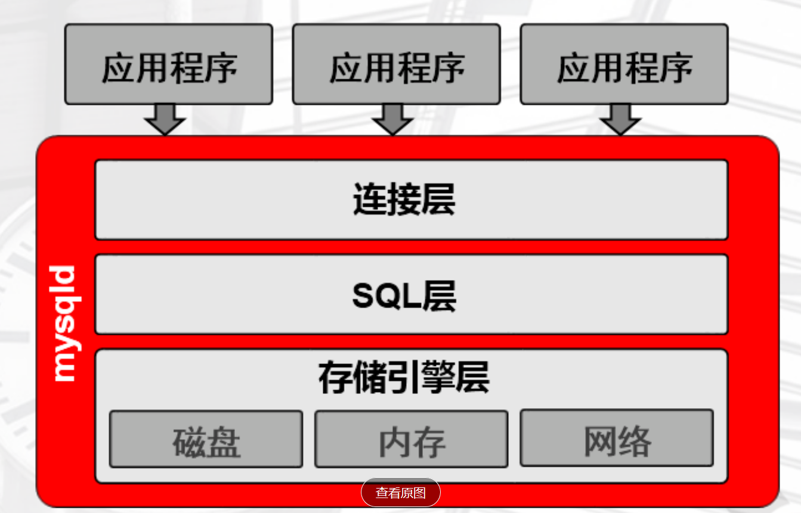

## mysqld的程序结构

## 连接层

1. 提供连接协议：TCP/IP，SOCKET
2. 提供验证：用户名，密码，IP,SOCKET
3. 提供专用连接线程；接受用户SQL，返回结果

查看连接线程基本情况：show processlist;

## SQL层

1. 接收上层传来的SQL语句
2. 语法验证
3. 语义检查:判断语句类型
DDL:数据定义语句
DCL:数据控制语句
DML：数据操作语句
DQL：数据查询语句

4. 权限检查：用户对库表有没有操作权限
5. 解析器：对语句执行前，进行预处理，生成解析树（执行计划），说白了就是生成多种执行方案；
6. 优化器：根据解析器生成地多种执行方案，进行判断，选择最优地执行计划；
        代价模型：资源（CPU,IO, MEM)的损耗评估性能好坏
7. 执行器：根据最有执行计划，执行SQL语句，产生执行结果
        执行结果：在磁盘的xxxxx位置上
8. 提供查询缓存（默认是没有1开启的），会使用redis tair替代缓存功能
9. 提供日志记录：binlog,默认不开启

## 存储引擎层（类似于Linux中的文件系统）

1. 负责根据SQL层执行的结果，从磁盘上拿数据
2. 将16进制的磁盘数据，交由SQL结构化成表
3. 连接层的专用线程返回给用户
