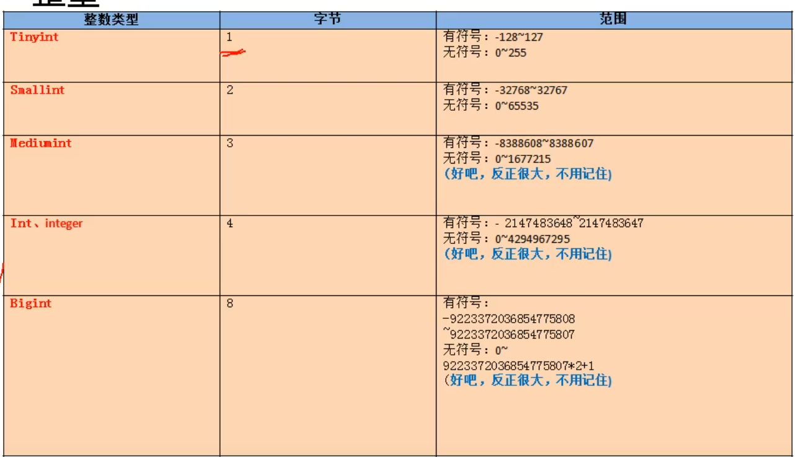
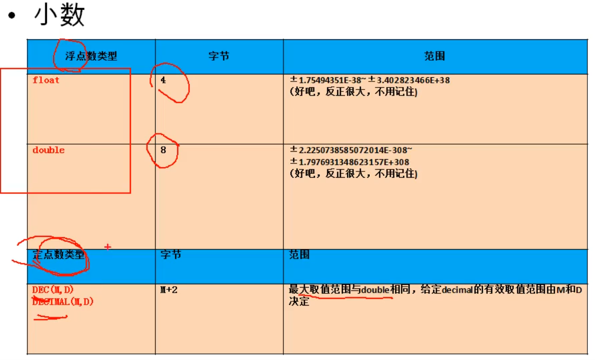

## 整型

无符号：
unsigned
特点：

1. 默认有符号
2. 如果不设置长度，有默认长度，长度不够，可用0填充 zerofill

## 小数

float（M,D) DOUBLE(M,D), DEC(M,D) DECIMAL(M,D)

**特点**
1. M和D的含义
    M：整数部位+小数部位
    D：小数部位
    M和D可以省略，如果式decimal，默认M为10，D为0
2. 定点型精度高，涉及货币计算时可选用
3. 所选择的类型越简单越好，能保存数值的类型越小越好