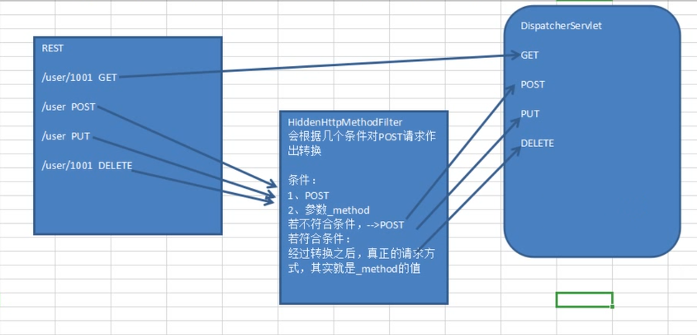

## 在web.xml种配置该过滤器

```xml
<filter>
    <filter-name>hiddenHttpMethodFilter</filter-name>
    <filter-class>org.springframework.web.filter.HiddenHttpMethodFilter</filter-class>
  </filter>
  
  <filter-mapping>
    <filter-name>hiddenHttpMethodFilter</filter-name>
    <url-pattern>/*</url-pattern>
  </filter-mapping>
```