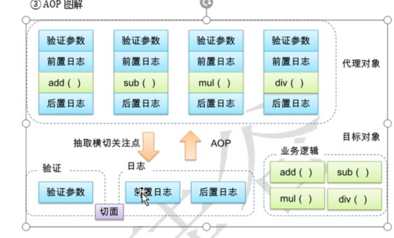

1.AOP(Aspect Oriented Programming):面向切面编程
    面向对象  纵向继承机制
    面向切面  横向抽取机制
2. 切面用于**模块化横切关注点**
3. 切面：实现了公共功能（横切关注点）的类

## 术语

1. 横切关注点：从每个方法中抽取出来的非核心业务
2. 切面：封装横切关注点的类
3. 通知：切面必须要完成的具体动作
4. 目标：被通知的对象
5. 代理；向目标对象应用通知之后的创建的代理对象
6. 连接点：对应程旭执行的某个特定位置
7. 切入点：定位连接点的方式